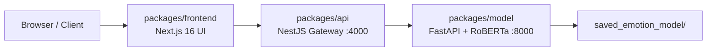

# 🚀 GoEmotions-RoBERTa-XAI

   
   
   
  

Production-grade monorepo for **GoEmotions-RoBERTa-XAI: Fine-Tuned Sentiment Classifier with Token-Level Attribution Heatmaps**.

The system classifies text into 7 emotion groups, generates token-level Integrated Gradients heatmaps, and exposes a chatbot-style API through a NestJS gateway and Next.js UI.

## Architecture



| Service | Path | Port | Responsibility |
|---|---|---:|---|
| Frontend UI | `packages/frontend` | 3000 | Input form, prediction panel, token heatmap rendering |
| API Gateway | `packages/api` | 4000 | Proxy `/predict`, `/explain`, `/chat`, `/grok/classify` |
| Model Service | `packages/model` | 8000 | RoBERTa inference + Captum Integrated Gradients |

## Classification Categories

| ID | Label |
|---:|---|
| 0 | Normal (neutral) |
| 1 | Sadness (sadness, grief) |
| 2 | Joy (joy, amusement, excitement, optimism) |
| 3 | Hate / Anger (anger, annoyance, disapproval, disgust) |
| 4 | Sexual / Desire (desire) |
| 5 | Fear / Anxiety (fear, nervousness) |
| 6 | Love / ভালোবাসা (love) |

## Monorepo Directory Tree

All application code lives under `packages/` — three packages only: **frontend**, **api**, and **model**.

```
.
├── README.md
├── LICENSE.md
├── package.json                      # root pnpm scripts
├── pnpm-workspace.yaml               # packages/*
├── pnpm-lock.yaml
├── .npmrc
├── .env.example
├── docker-compose.yml                # orchestrates model + api + frontend
├── docker-compose.override.yml       # dev hot-reload overrides
├── .dockerignore
├── .github/
│   └── workflows/
│       └── ci.yml
├── .eslintrc.json
├── .gitignore
├── data/
│   └── raw/
│       └── goemotions/               # GoEmotions dataset
├── notebooks/
│   └── lab_final.ipynb               # training + XAI notebook
├── scripts/                          # utility scripts
├── project-plan/                     # gitignored production checklist
└── packages/
    ├── frontend/                     # Next.js 16 UI (:3000)
    │   ├── app/
    │   │   ├── layout.tsx
    │   │   ├── page.tsx
    │   │   └── globals.css
    │   ├── components/
    │   │   └── HeatmapText.tsx
    │   ├── lib/
    │   │   └── api.ts
    │   ├── public/
    │   ├── Dockerfile
    │   ├── next.config.ts
    │   ├── package.json
    │   └── tsconfig.json
    ├── api/                          # NestJS API Gateway (:4000)
    │   ├── src/
    │   │   ├── main.ts
    │   │   ├── app.module.ts
    │   │   ├── app.controller.ts
    │   │   ├── model.service.ts
    │   │   └── dto/
    │   │       └── text.dto.ts
    │   ├── Dockerfile
    │   ├── package.json
    │   └── tsconfig.json
    └── model/                        # FastAPI RoBERTa service (:8000)
        ├── app/
        │   ├── main.py
        │   ├── inference.py
        │   ├── explainability.py
        │   ├── labels.py
        │   └── schemas.py
        ├── saved_emotion_model/
        │   ├── label_map.json
        │   ├── README.md
        │   └── weights/              # drop trained checkpoint here
        ├── Dockerfile
        └── requirements.txt
```

## Technologies

- **ML:** Python, FastAPI, PyTorch, Hugging Face Transformers, Captum (Integrated Gradients)
- **Gateway:** NestJS, Axios, class-validator
- **UI:** Next.js 16, React 18, Tailwind CSS, TypeScript
- **DevOps:** Docker Compose, GitHub Actions, ESLint

### 12 Algorithms & Methods

1. RoBERTa (Transformer encoder)
2. Logistic Regression (baseline)
3. SVM (baseline)
4. LSTM (alternate deep model)
5. CNN for text (alternate)
6. DistilRoBERTa (compact transformer)
7. AdamW fine-tuning recipe
8. Focal Loss / label smoothing
9. Integrated Gradients (Captum)
10. Layer-wise Relevance Propagation (LRP)
11. Grad-CAM token adaptation
12. ONNX quantization / pruning

## Dataset

- **GoEmotions** (Google Research)
- URL: https://github.com/google-research/google-research/tree/master/goemotions
- Local path: `data/raw/goemotions/`

## Model Weights

Copy your trained checkpoint into `packages/model/saved_emotion_model/`:

```python
trainer.save_model("./saved_emotion_model")
tokenizer.save_pretrained("./saved_emotion_model")
```

If weights are missing, the model service falls back to `roberta-base` with a 7-class head for local development only.

## API Endpoints

### Model service (`:8000`)

| Method | Path | Description |
|---|---|---|
| GET | `/health` | Service + model status |
| POST | `/predict` | Emotion probabilities only |
| POST | `/explain` | Probabilities + token heatmap |
| POST | `/chat` | Classification + chatbot reply + heatmap |

### NestJS gateway (`:4000/api`)

| Method | Path | Description |
|---|---|---|
| GET | `/api/health` | Gateway + downstream model health |
| POST | `/api/predict` | Proxy to model `/predict` |
| POST | `/api/explain` | Proxy to model `/explain` |
| POST | `/api/chat` | Proxy to model `/chat` |
| POST | `/api/grok/classify` | Grok-compatible classify + heatmap |

## Package Manager (pnpm)

This monorepo uses **pnpm workspaces** exclusively.

```yaml
# pnpm-workspace.yaml
packages:
  - 'packages/*'
```

Node workspaces: `packages/frontend`, `packages/api`  
Python service (`packages/model`) is managed via `pip` + `requirements.txt`.

### Local setup

```bash
corepack enable
pnpm install
cp .env.example .env
pnpm dev                 # runs api + frontend in parallel
```

## Docker Run

### Production

```bash
pnpm docker:up
# or
docker compose up --build
```

Services:
- UI: http://localhost:3000
- API Gateway: http://localhost:4000/api
- Model: http://localhost:8000

### Development (hot reload)

```bash
docker compose up --build
```

`docker-compose.override.yml` automatically mounts source folders and enables reload for all services.

## Local Development (without Docker)

```bash
corepack enable
pnpm install

# Terminal 1 - model (Python)
cd packages/model
pip install -r requirements.txt
uvicorn app.main:app --reload --port 8000

# Terminal 2 + 3 - api + frontend (from repo root)
pnpm dev:api
pnpm dev:frontend
```

## Kaggle / Training Guidelines

1. Download GoEmotions and map labels to the 7 target categories.
2. Tokenize with `roberta-base`, `MAX_LENGTH=128`.
3. Train baselines (Logistic Regression, SVM) for comparison.
4. Fine-tune RoBERTa: batch 16, lr `2e-5`, epochs 3–5, weight decay `0.01`.
5. Track macro F1 and per-class F1; early-stop on macro F1.
6. Generate token heatmaps with Integrated Gradients (Captum).
7. Export best checkpoint to `packages/model/saved_emotion_model/`.
8. Log experiments with W&B or TensorBoard; pin dependencies in `requirements.txt`.

## CI

GitHub Actions runs:
- pnpm install + lint across workspaces
- Python import smoke test for model service
- `docker compose build`

## License

MIT — Copyright (c) 2026 Md. Nazmus Sakib ([engrsakib.com](https://engrsakib.com))
