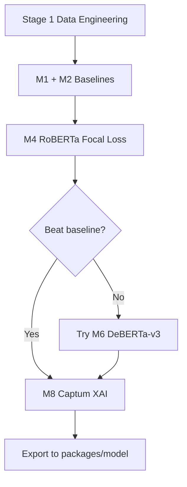

# 02 — Eight Recommended Models

## Overview

Eight algorithms cover classical baselines, transformer encoders, imbalance handling, and explainability. Use **M4** as the default production model; compare others on validation macro-F1.

---

## M1: TF-IDF + Logistic Regression

| Property | Value |
|----------|-------|
| ID | `m1_tfidf_logreg` |
| Type | Classical ML |
| Strength | Fast (~10 s), interpretable weights |
| Expected macro-F1 | ~0.50 |

**When to use:** Sanity check before GPU training.

---

## M2: TF-IDF + Linear SVM

| Property | Value |
|----------|-------|
| ID | `m2_tfidf_svm` |
| Type | Classical ML |
| Strength | Strong linear margins, balanced classes |
| Expected macro-F1 | ~0.48–0.52 |

**When to use:** Compare against M1; pick higher macro-F1 baseline.

---

## M3: RoBERTa-base Fine-Tuning

| Property | Value |
|----------|-------|
| ID | `m3_roberta_base` |
| HF model | `roberta-base` |
| Loss | Cross-entropy |
| Strength | Matches production architecture |

```bash
python scripts/run_pipeline.py --model-id m3_roberta_base --skip-data
```

**When to use:** Standard fine-tune without focal loss.

---

## M4: RoBERTa-base + Focal Loss (Recommended)

| Property | Value |
|----------|-------|
| ID | `m4_roberta_focal` |
| HF model | `roberta-base` |
| Loss | Focal (γ=2.0) + inverse-frequency weights |
| Strength | Best for sadness (4%) and desire (2.5%) minority classes |

```bash
python scripts/run_pipeline.py --model-id m4_roberta_focal --deploy
```

**When to use:** **Default choice** for Kaggle training and production export.

---

## M5: DistilRoBERTa-base

| Property | Value |
|----------|-------|
| ID | `m5_distilroberta` |
| HF model | `distilroberta-base` |
| Strength | ~40% smaller, 60% faster inference |

**When to use:** Mobile/edge deployment where latency matters.

---

## M6: DeBERTa-v3-base

| Property | Value |
|----------|-------|
| ID | `m6_deberta_v3` |
| HF model | `microsoft/deberta-v3-base` |
| Strength | Disentangled attention; often +1–2% macro-F1 |

**When to use:** When accuracy is priority over training speed.

---

## M7: XLM-RoBERTa-base

| Property | Value |
|----------|-------|
| ID | `m7_xlm_roberta` |
| HF model | `xlm-roberta-base` |
| Strength | Multilingual tokenization for mixed-language Reddit text |

**When to use:** Dataset contains non-English or code-switched comments.

---

## M8: Captum Integrated Gradients (XAI)

| Property | Value |
|----------|-------|
| ID | `m8_captum_ig` |
| Type | Explainability (not a classifier) |
| Method | LayerIntegratedGradients on embeddings |
| Steps | 32 |

**When to use:** Always run after training to validate token heatmaps before export.

---

## Recommended Strategy for Best Solution



| Priority | Model | Reason |
|----------|-------|--------|
| 1st | **M4** | Best balance of accuracy + imbalance handling + production match |
| 2nd | **M6** | If M4 macro-F1 plateaus below target |
| 3rd | **M5** | If deployment size/speed is critical |
| 4th | **M7** | If multilingual errors are observed |
| Always | **M1, M2, M8** | Baselines + XAI validation |

---

## Registry Implementation

All models defined in `src/training/model_registry.py` and listed in `config/train_config.yaml`.
