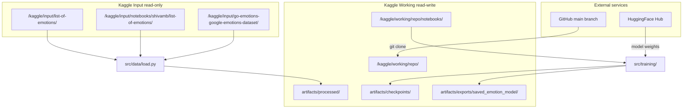
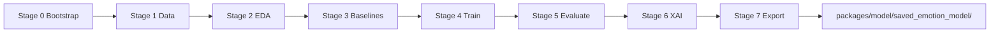

# 03 — Kaggle GPU Training Runbook

Official guide for training **GoEmotions-RoBERTa-XAI** on Kaggle.  
This document covers environment setup, data mounting, pipeline execution, artifact export, and production handoff.

| | |
|---|---|
| **Repository** | [github.com/engrsakib/GoEmotions-RoBERTa-XAI](https://github.com/engrsakib/GoEmotions-RoBERTa-XAI) |
| **Branch** | `main` |
| **Entry point** | `notebooks/kaggle/run_training.py` |
| **Orchestrator** | `notebooks/scripts/run_pipeline.py` |

**Related docs:** [01-data-engineering.md](01-data-engineering.md) · [02-eight-models.md](02-eight-models.md) · [04-export-checklist.md](04-export-checklist.md) · [IEEE_METHODOLOGY.md](IEEE_METHODOLOGY.md)

---

## 1. Overview

### 1.1 What this pipeline does

1. Loads raw **GoEmotions** data from Kaggle Input (no KaggleHub on Kaggle).
2. Maps 28 emotion labels → **7 production classes** aligned with `packages/model/`.
3. Trains baselines (TF-IDF) and transformer models (RoBERTa + Focal Loss default).
4. Evaluates with **macro-F1**, runs **Captum Integrated Gradients** (XAI).
5. Exports HuggingFace weights to `artifacts/exports/saved_emotion_model/`.

### 1.2 Who should use this guide

| Audience | Use case |
|----------|----------|
| ML engineer | First-time Kaggle GPU training run |
| Researcher | Reproducible experiment on GoEmotions |
| MLOps | Export weights for FastAPI serving |

### 1.3 Prerequisites checklist

| # | Requirement | How to verify |
|---|-------------|---------------|
| 1 | Kaggle account with GPU quota | Settings → Accelerator shows GPU T4 x2 |
| 2 | Internet **ON** | Required for `git clone` + HuggingFace |
| 3 | GoEmotions dataset attached as **Input** | Step 3 below |
| 4 | ~2 hours GPU time (4 epochs, T4) | Session persistence recommended |

---

## 2. Architecture

### 2.1 Kaggle runtime layout

Kaggle exposes three filesystem zones. The pipeline reads from **Input**, writes all artifacts to **Working**.



### 2.2 Training pipeline stages

Seven stages orchestrated by `scripts/run_pipeline.py` (Stage 0 bootstrap is optional on Kaggle when using `--skip-bootstrap`).



| Stage | Module | Primary output |
|-------|--------|----------------|
| 0 | `src/bootstrap/` | Environment ready |
| 1 | `src/data/` | `artifacts/processed/*.csv`, `data_stats.json` |
| 2 | `src/visualization/eda.py` | `artifacts/figures/class_distribution.png` |
| 3 | `src/training/baselines.py` | M1 LogReg, M2 SVM macro-F1 |
| 4–5 | `src/training/trainer_setup.py` | Checkpoints, test metrics |
| 6 | `src/xai/captum_ig.py` | Token heatmap validation |
| 7 | `src/training/trainer_setup.py` | `artifacts/exports/saved_emotion_model/` |

**Default model:** `m4_roberta_focal` (RoBERTa-base + Focal Loss). See [02-eight-models.md](02-eight-models.md).

### 2.3 Code layout (under `notebooks/`)

```
notebooks/
├── kaggle/run_training.py      # Kaggle entry: full pipeline + --deploy
├── scripts/run_pipeline.py     # CLI orchestrator (Stages 0–7)
├── config/train_config.yaml    # Hyperparameters, model registry
├── src/
│   ├── paths.py                # Kaggle vs local path resolution
│   ├── data/                   # load → map → clean → split → reporting
│   ├── training/               # baselines, focal loss, HF Trainer
│   ├── visualization/          # EDA figures
│   └── xai/                    # Captum IG (mirrors production API)
└── artifacts/                  # gitignored — all run outputs
    ├── processed/
    ├── checkpoints/
    ├── figures/
    └── exports/
```

### 2.4 Path reference

| Path | Role |
|------|------|
| `/kaggle/working/repo/` | Cloned GitHub repo (`main`) |
| `/kaggle/working/repo/notebooks/` | **Working directory** — run all commands here |
| `/kaggle/input/.../` | Read-only GoEmotions CSV mount |
| `artifacts/processed/` | `train.csv`, `validation.csv`, `test.csv`, `label_map.json`, `data_stats.json` |
| `artifacts/checkpoints/` | HuggingFace epoch checkpoints |
| `artifacts/exports/saved_emotion_model/` | Production-ready export |

---

## 3. Setup (one-time per notebook)

### 3.1 Create notebook and enable GPU

1. Open [kaggle.com/code](https://www.kaggle.com/code) → **New Notebook**
2. Configure sidebar:

| Setting | Value | Reason |
|---------|-------|--------|
| **Accelerator** | GPU T4 x2 | Transformer training + FP16 |
| **Internet** | **ON** | `git clone`, HuggingFace download |
| **Persistence** | ON | Survive short disconnects |

### 3.2 Attach GoEmotions dataset

1. Click **Add Input** (+ Add data)
2. Search: `go-emotions-google-emotions-dataset`
3. Select **[GoEmotions Google Emotions Dataset](https://www.kaggle.com/datasets/shivamb/go-emotions-google-emotions-dataset)** (shivamb)
4. Click **Add** → **Save Version** (Input mounts only after Save Version)

**Loader search order** (see `src/data/load.py`):

```
/kaggle/input/notebooks/shivamb/list-of-emotions/
/kaggle/input/list-of-emotions/
/kaggle/input/go-emotions-google-emotions-dataset/
→ recursive walk of /kaggle/input/
```

KaggleHub is **never** called on Kaggle (avoids non-interactive BackendError).

**Verify Input mounted:**

```python
from pathlib import Path

for path in Path("/kaggle/input").rglob("*.csv"):
    print(path)
```

Expect at least one GoEmotions CSV path before training.

---

## 4. Execution runbook (3 cells)

Run cells **in order**. Re-run Cell 1 after any GitHub update or session restart to pull fresh `main`.

### Cell 1 — Clean clone and verify layout

Removes stale `/kaggle/working/repo` and shallow-clones `main`.

```python
import os
import shutil

REPO_URL = "https://github.com/engrsakib/GoEmotions-RoBERTa-XAI.git"
REPO_DIR = "/kaggle/working/repo"
NOTEBOOKS_DIR = f"{REPO_DIR}/notebooks"

if os.path.exists(REPO_DIR):
    shutil.rmtree(REPO_DIR)
    print(f"Cleaned previous directory: {REPO_DIR}")

!git clone --branch main --depth 1 {REPO_URL} {REPO_DIR}

os.chdir(NOTEBOOKS_DIR)
print("Updated Working Directory:", os.getcwd())
!ls -la
```

**Layout check** — confirm these exist:

| Item | Purpose |
|------|---------|
| `scripts/` | `run_pipeline.py` |
| `src/` | Data, training, XAI modules |
| `config/` | `train_config.yaml` |
| `kaggle/` | `run_training.py` |
| `requirements-train.txt` | Dependencies |

### Cell 2 — Install dependencies and verify GPU

```python
!pip install -q -r requirements-train.txt

import torch

cuda_ok = torch.cuda.is_available()
gpu_name = torch.cuda.get_device_name(0) if cuda_ok else "none"
print(f"CUDA available: {cuda_ok}")
print(f"GPU: {gpu_name}")
```

**Expected:** `CUDA available: True` · `GPU: Tesla T4`  
If False → enable GPU T4 x2 in Settings, restart session, re-run Cells 1–2.

### Cell 3 — Run full training pipeline

```python
import os

os.chdir("/kaggle/working/repo/notebooks")
!python kaggle/run_training.py
```

Equivalent with explicit flags:

```python
!python scripts/run_pipeline.py --skip-bootstrap --deploy --model-id m4_roberta_focal
```

**Stage 1 metadata:** the pipeline prints label schema, raw audit, class distributions, and split sizes via `src/data/reporting.py`. Artifacts are also saved to `artifacts/processed/data_stats.json`.

**Verify data stage output:**

```python
import json
from pathlib import Path

stats_path = Path("artifacts/processed/data_stats.json")
if stats_path.exists():
    print(json.dumps(json.load(stats_path.open()), indent=2)[:2500])
```

---

## 5. Advanced operations

### 5.1 Run stages individually

After Cells 1–2, run one stage at a time:

```python
import os
os.chdir("/kaggle/working/repo/notebooks")

# Stage 1 — data engineering
!python scripts/run_pipeline.py --skip-bootstrap --stage data

# Stage 2 — EDA
!python scripts/run_pipeline.py --skip-bootstrap --skip-data --stage eda

# Stage 3 — baselines (M1, M2)
!python scripts/run_pipeline.py --skip-bootstrap --skip-data --stage baselines

# Stage 4+5 — train + evaluate
!python scripts/run_pipeline.py --skip-bootstrap --skip-data --stage train --model-id m4_roberta_focal

# Stage 6 — Captum XAI
!python scripts/run_pipeline.py --skip-bootstrap --skip-data --stage xai

# Stage 7 — export + deploy copy
!python scripts/run_pipeline.py --skip-bootstrap --skip-data --stage export --deploy
```

**Note:** `--skip-data` loads cached splits from `artifacts/processed/`. If `train.csv` is missing, Stage 1 runs automatically instead of failing.

### 5.2 Resume after session disconnect

```python
# Cell 1 + Cell 2 again, then:
!python scripts/run_pipeline.py --skip-bootstrap --skip-data --stage train --model-id m4_roberta_focal
```

Checkpoints are saved each epoch under `artifacts/checkpoints/`.

### 5.3 Switch transformer model

| Command | Model |
|---------|-------|
| `--model-id m4_roberta_focal` | RoBERTa + Focal Loss **(default)** |
| `--model-id m3_roberta_base` | RoBERTa + cross-entropy |
| `--model-id m5_distilroberta` | DistilRoBERTa (faster) |
| `--model-id m6_deberta_v3` | DeBERTa-v3 (higher accuracy) |
| `--model-id m7_xlm_roberta` | XLM-RoBERTa (multilingual) |

```python
!python scripts/run_pipeline.py --skip-bootstrap --skip-data --model-id m6_deberta_v3 --deploy
```

### 5.4 One-cell quick start (experienced users)

```python
import os, shutil, subprocess, sys

REPO_URL = "https://github.com/engrsakib/GoEmotions-RoBERTa-XAI.git"
REPO_DIR = "/kaggle/working/repo"
NOTEBOOKS_DIR = f"{REPO_DIR}/notebooks"

if os.path.exists(REPO_DIR):
    shutil.rmtree(REPO_DIR)

subprocess.run(["git", "clone", "--branch", "main", "--depth", "1", REPO_URL, REPO_DIR], check=True)
os.chdir(NOTEBOOKS_DIR)
subprocess.run([sys.executable, "-m", "pip", "install", "-q", "-r", "requirements-train.txt"], check=True)

import torch
print(f"CUDA: {torch.cuda.is_available()} | GPU: {torch.cuda.get_device_name(0) if torch.cuda.is_available() else 'CPU'}")

subprocess.run([sys.executable, "kaggle/run_training.py"], check=True)
print("\nDone. Weights: /kaggle/working/repo/notebooks/artifacts/exports/saved_emotion_model/")
```

---

## 6. Export and production handoff

### 6.1 Verify export artifacts

```python
!ls -la /kaggle/working/repo/notebooks/artifacts/exports/saved_emotion_model/
```

| File | Required |
|------|----------|
| `config.json` | Yes |
| `model.safetensors` or `pytorch_model.bin` | Yes |
| `tokenizer.json`, `vocab.json`, `merges.txt` | Yes |
| `label_map.json` | Yes |

### 6.2 Download from Kaggle

1. Notebook **Output** tab
2. Download `repo/notebooks/artifacts/exports/saved_emotion_model/`

### 6.3 Deploy to local production service

```bash
cp -r saved_emotion_model/* packages/model/saved_emotion_model/
```

Full checklist: [04-export-checklist.md](04-export-checklist.md).

---

## 7. Troubleshooting

| Symptom | Likely cause | Fix |
|---------|--------------|-----|
| Stale code / old bugs | Cached clone | Re-run **Cell 1** (clean clone) |
| `FileNotFoundError` GoEmotions | Input not mounted | Add dataset → **Save Version** |
| `CUDA available: False` | CPU-only session | Settings → GPU T4 x2 → restart |
| `git clone` fails | Internet OFF | Enable Internet in Settings |
| OOM during training | Batch too large | `train_config.yaml`: `batch_size: 8`, `gradient_accumulation_steps: 2` |
| No dataset metadata in logs | Old code | Re-clone `main`; Stage 1 uses `src/data/reporting.py` |
| `train.csv` missing + `--skip-data` | First run skipped data | Pipeline auto-runs Stage 1; or run `--stage data` |
| Session disconnected mid-train | Kaggle timeout | Cells 1–2, then `--skip-data --stage train` |

---

## 8. Success criteria

Training is complete when all checks pass:

- [ ] Stage 1 logs show label schema + class distribution (`data_stats.json` exists)
- [ ] Test **macro-F1** beats TF-IDF baseline (~0.50)
- [ ] Per-class F1 for **sadness** and **desire** > 0.35
- [ ] `artifacts/exports/saved_emotion_model/config.json` present
- [ ] Captum XAI runs without token/heatmap length mismatch
- [ ] `--deploy` copies weights to `packages/model/saved_emotion_model/` (local)

---

## 9. References and acknowledgements

| Resource | Link |
|----------|------|
| Repository | https://github.com/engrsakib/GoEmotions-RoBERTa-XAI |
| GoEmotions (Kaggle) | https://www.kaggle.com/datasets/shivamb/go-emotions-google-emotions-dataset |
| GoEmotions (original) | https://github.com/google-research/google-research/tree/master/goemotions |
| Data pipeline | [01-data-engineering.md](01-data-engineering.md) |
| Model registry | [02-eight-models.md](02-eight-models.md) |
| Methodology | [IEEE_METHODOLOGY.md](IEEE_METHODOLOGY.md) |
| Export checklist | [04-export-checklist.md](04-export-checklist.md) |

**Dataset citation:** GoEmotions (Demszky et al., 2020), via [shivamb/go-emotions-google-emotions-dataset](https://www.kaggle.com/datasets/shivamb/go-emotions-google-emotions-dataset).

**Base models:** HuggingFace Transformers (`roberta-base`, etc.) — see `config/train_config.yaml`.
